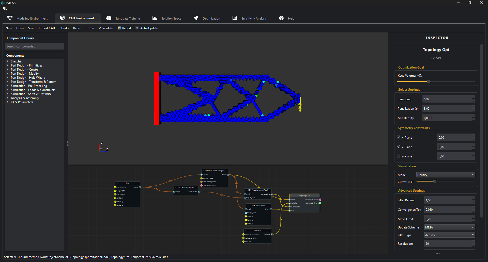
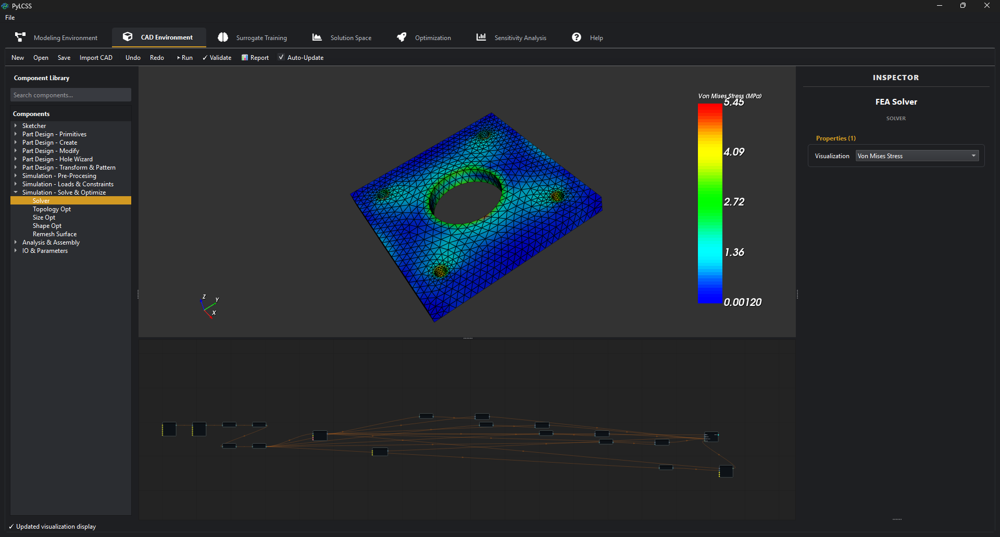
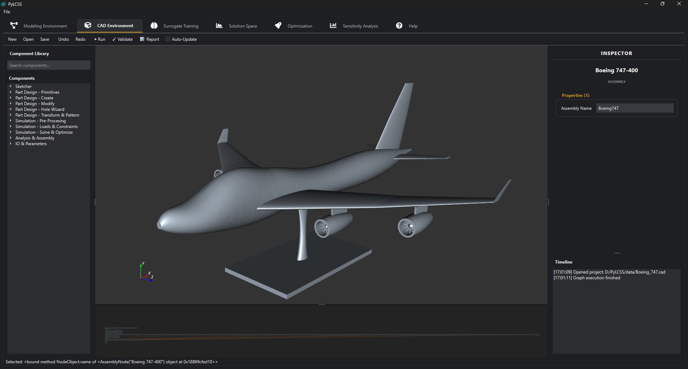
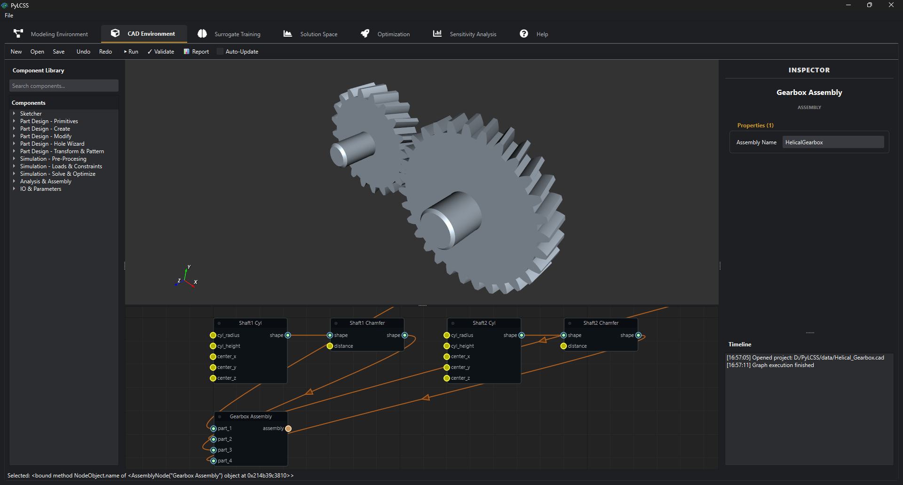

# PyLCSS: Low-Code System Solutions

<div align="center">


<br/>

<a href="https://youtu.be/fQuLZ5LnxQs" target="_blank">
  
</a>







**(Click the video thumbnail above to watch the demonstration on YouTube!)**

**Source-Available Engineering Simulation & Optimization Platform**

*Visual Modeling · Parametric CAD · Topology Optimisation · FEA · Solution Spaces · Sensitivity Analysis · Surrogate AI · Multi-Objective Optimization*

[](LICENSE)
[](https://www.python.org/)
[]()

</div>

---

## Overview

**PyLCSS** (Python Low-Code System Solutions) is a professional engineering design platform. It allows engineers to model complex multidisciplinary systems through a node-based visual interface, run parametric CAD and FEA simulations, explore high-dimensional **Solution Spaces**, and optimise designs using 7 different algorithms — all within a single desktop application.

Built for real-world engineering workflows, PyLCSS features a crash-free multi-threaded architecture, vectorised computation kernels, comprehensive file I/O, external solver integration, and an integrated AI coding assistant.

PyLCSS is more than a standalone CAD environment: the CAD graph is the parametric source of truth for downstream simulation and design optimisation. STEP is supported for exchange, but `.cad` graphs and exposed parameters are required when a model must be rebuilt, swept, or optimised.

---

## Scientific Foundation

PyLCSS implements the **Solution Space** approach for robust design: instead of seeking a single optimal point (which may be sensitive to tolerances), it identifies **box-shaped regions** of valid designs, enabling decoupled subsystem development.

> *Markus Zimmermann, Johannes Edler von Hoessle*, "Computing solution spaces for robust design", *Int. J. Numer. Meth. Engng.*, 2013. [DOI: 10.1002/nme.4450](https://doi.org/10.1002/nme.4450)

---

## Key Features

### Parametric Engineering Design Environment
- **70+ Node Types** — Primitives, Booleans, Fillets, Chamfers, Sweeps, Lofts, Shells, Patterns, Imports
- **Code-Assisted Modeling Direction** — Parts and assemblies should remain reproducible through graph nodes, exposed parameters, imported STEP/STL geometry, or code-based creation blocks rather than hidden manual edits
- **Topology Optimisation** — SIMP with MMA/OC solvers, density/sensitivity filtering, Heaviside projection, symmetry constraints, shape recovery with marching cubes, and **direct STL/OBJ export** of optimised shapes
- **Advanced Nodes** — Thicken, Pipe, Split, Text emboss, Math Expression evaluator, Import STEP/STL
- **Real-Time 3D Viewer** — VTK-based with density cutoff preview during optimisation
- **Measurement** — Distance, surface area, and volume nodes

### Finite Element Analysis (FEA)
- **Netgen Meshing + scikit-fem Mesh Containers** — Tetrahedral/triangular mesh generation and internal mesh representation
- **CalculiX Static Solver Backend** — PyLCSS writes a CalculiX `.inp`, runs `ccx`, parses `.frd`, and displays displacement + Von Mises stress in the in-app VTK viewer
- **Linear Elasticity Results** — Displacement, von Mises stress, compliance, volume, and mass
- **FEA Results Nodes** — Stress extraction, displacement, reaction forces
- **Remeshing** — Surface-to-solid conversion for topology-optimised shapes (up to 20 000 faces)
- **CalculiX-Coupled Optimisation** — Topology, shape, and size optimisation now run through repeated CalculiX evaluations instead of the removed in-process scikit-fem solver path

### Crash / Impact Simulation
- **OpenRadioss Backend** — PyLCSS writes an LS-DYNA-style keyword deck, runs Starter + Engine, converts the `A001`/`A002`… animation files via `anim_to_vtk`, and plays the frames in the crash viewer
- **Run Radioss Deck Node** — Existing OpenRadioss/LS-DYNA `.rad`/`.k` decks can be launched and imported
- **Current Limitation** — The generated crash deck is still a thin integration layer. Even simple explicit simulations can run slowly when the mesh has tiny elements, the end time/output frequency is high, or animation conversion dominates.

### Multi-Objective Optimisation (7 Solvers)
| Algorithm | Type | Best For |
|-----------|------|----------|
| SLSQP | Gradient-based | Fast local optimisation with constraints |
| COBYLA | Derivative-free | Noisy or non-differentiable models |
| trust-constr | Interior point | Large-scale constrained problems |
| Differential Evolution | Population-based | Global search, black-box functions |
| Nevergrad | Meta-optimiser | Algorithm-agnostic global search |
| **NSGA-II** | Multi-objective evolutionary | Pareto fronts with 2–5 objectives |
| **Multi-Start** | Hybrid global+local | Avoiding local minima via LHS starts |

### Global Sensitivity Analysis (4 Methods)
| Method | Indices | Use Case |
|--------|---------|----------|
| **Sobol** | S1, ST, S2 interaction | Variance decomposition |
| **Morris** | μ, μ*, σ | Screening with few evaluations |
| **FAST** | S1, ST | Fourier decomposition, fast convergence |
| **Delta (DMIM)** | δ, S1 | Moment-independent, distribution-based |

- Batch analysis across all outputs, convergence study, importance ranking (Critical / Important / Minor / Negligible)

### Surrogate Modelling & Validation
- **5 Algorithms** — MLP Neural Network (PyTorch), Random Forest, Gradient Boosting, Gaussian Process, SVR
- **Cross-Validation** — K-Fold (2–20 folds) and Leave-One-Out
- **Model Comparison** — Automated comparison of all 5 algorithms on same dataset
- **Feature Importance** — Permutation-based and tree-based importance analysis
- **Hyperparameter Optimisation** — Grid search and random search with built-in search spaces

### Solution Space Exploration
- **Monte Carlo Sampling** — Vectorised evaluation of thousands of design variants
- **Visualisation** — 2D scatter, parallel coordinates, feasibility maps
- **Product Family Analysis** — Common platform identification across product variants
- **Step Analysis** — Iterative box-size refinement

### Export Capabilities
| Category | Formats |
|----------|---------|
| **CAD Export** | STEP, STL, OBJ |
| **Data Export** | CSV, Images (PNG, SVG, PDF) |
| **Project** | Project Folder (JSON-based `.cad` files + data) |

### Engineering Utilities
- **Expression-Aware Inputs** — Safe AST-based evaluation (sin, cos, sqrt, log, variables) in input fields
- **Unit-Aware Inputs** — Physical unit support via pint (SI, Imperial, CGS) in simulation nodes

### LLM-Powered Voice Assistant
- **Natural Language Control** — "Zoom in", "Create a helical gear", "Go to properties"
- **Local STT** — Faster-Whisper for real-time speech recognition
- **Multi-Provider LLM** — OpenAI, Claude, Gemini, LM-Studio
- **Privacy-First** — Optional fully local execution

---

## Installation

### Prerequisites
- **Python** 3.10+
- **OS** Windows 10/11 (macOS and Linux: experimental)

### Quick Install

```bash
# Clone
git clone <repository-url>
cd pylcss

# Virtual environment
python -m venv .venv
# Windows:
.venv\Scripts\activate
# Linux/Mac:
source .venv/bin/activate

# Dependencies
pip install -r requirements.txt

# (Optional) Download CalculiX + OpenRadioss native binaries.
# These are NOT pip-installable; the script fetches the upstream releases
# into <repo>/external_solvers/ and writes solver_paths.json.
python scripts/install_solvers.py

# Launch
python scripts/main.py
```

Or on Windows: double-click `run_gui.bat`.

### External solver binaries

| Backend | Provided by | How PyLCSS finds it |
|---------|-------------|----------------------|
| CalculiX (`ccx`) | `python scripts/install_solvers.py --only ccx` | `PYLCSS_CALCULIX_CCX`, `CALCULIX_CCX`, `ccx_static`, `ccx`, or `ccx.exe` on `PATH` |
| OpenRadioss Starter/Engine | `python scripts/install_solvers.py --only radioss` | `PYLCSS_OPENRADIOSS_STARTER`, `PYLCSS_OPENRADIOSS_ENGINE`, or `starter_*`/`engine_*` on `PATH` |
| OpenRadioss `anim_to_vtk` | Bundled with the Radioss install above | `PYLCSS_OPENRADIOSS_ANIM2VTK` or `anim_to_vtk*` on `PATH` |

CalculiX and OpenRadioss are launched as external native processes. They are not pip dependencies and remain governed by their own upstream licenses.

---

## Quick Start

1. **Launch** — `python scripts/main.py`
2. **Load a Model** — `File → Open` → select a project from `data/`
3. **Validate** — Click "Validate" to check units and connections
4. **Solution Space** — Switch to Solution Space tab → "Compute"
5. **Visualise** — Plot Weight vs. Safety Factor
6. **Optimise** — Go to Optimisation tab → select objectives → Run

---

## Architecture

```
pylcss/
├── cad/                  # Parametric design graph (CadQuery + OCC)
│   ├── nodes/            # 50+ node types (modeling, meshing, FEA, TopOpt, crash)
│   ├── engine.py         # Graph execution engine
│   ├── runtime.py        # cad.fea / cad.crash / cad.topopt API
│   └── node_library.py   # Node registry
├── solver_backends/      # CalculiX and OpenRadioss deck/run/result adapters
├── optimization/         # 7 solvers (SciPy, Nevergrad, NSGA-II, Multi-Start)
├── sensitivity/          # 4 methods (Sobol, Morris, FAST, Delta)
├── solution_space/       # Monte Carlo, step analysis, product families
├── surrogate_modeling/   # 5 ML algorithms + CV + HPO + feature importance
├── io_manager/           # CAD/mesh/data/project I/O (15+ formats)
├── system_modeling/      # Graph-based system model builder
├── assistant_systems/    # LLM voice assistant & tools
└── user_interface/       # PySide6 + VTK desktop application
```

## Tech Stack

| Layer | Technologies |
|-------|-------------|
| **UI** | PySide6, NodeGraphQt, QtAwesome |
| **Parametric Design** | CadQuery, OpenCASCADE (OCP), VTK |
| **FEA / Crash** | Netgen, scikit-fem mesh containers, meshio, CalculiX (`ccx` + `.frd` round-trip), OpenRadioss (`starter`/`engine` + `anim_to_vtk` round-trip) |
| **Computation** | NumPy, SciPy, Pandas |
| **Visualisation** | VTK (3D), pyqtgraph (2D) |
| **ML** | PyTorch, scikit-learn |
| **Optimisation** | SciPy, Nevergrad, SALib |
| **Units** | pint |
| **Serialisation** | h5py, dill, joblib |
| **AI Assistant** | Faster-Whisper, OpenAI, Edge-TTS |

## License

Licensed under the **PolyForm Shield License 1.0.0**.

**Allowed:** Personal use, academic research, internal business use.
**Restricted:** You cannot use this software to build a competing product or service.

See [LICENSE](LICENSE) and [NOTICE](NOTICE) for full details.

<div align="center">
<sub>Copyright © 2026 Kutay Demir. All rights reserved.</sub>
</div>
