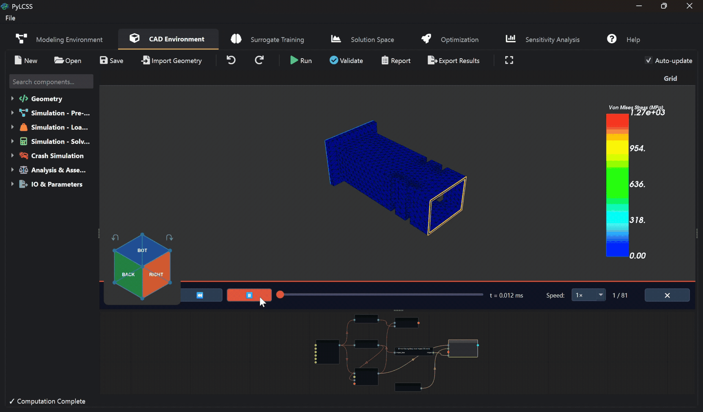

# PyLCSS: Low-Code System Solutions

<div align="center">


<br/>

<a href="https://youtu.be/fQuLZ5LnxQs" target="_blank">
  
</a>




**(Click the video thumbnail above to watch the demonstration on YouTube!)**

**Source-Available Engineering Simulation & Optimization Platform**

*Visual Modeling · Parametric CAD · Topology Optimization · FEA · Solution Spaces · Sensitivity Analysis · Surrogate AI · Multi-Objective Optimization*

[](LICENSE)
[](https://www.python.org/)
[]()
[](pylcss/user_interface/1773249914176.pdf)

</div>

---

## Overview

**PyLCSS** (Python Low-Code System Solutions) is an integrated product development environment that eliminates these handoffs. Engineers model multidisciplinary systems through a node-based visual interface, run parametric CAD and FEA simulations, explore high-dimensional **Solution Spaces**, and optimize designs using 7 algorithms — all within a single desktop application.

Visual, low-code workflows make advanced simulation methods — topology optimization, surrogate ML, global sensitivity analysis — accessible to engineers without a coding background. PyLCSS features a crash-free multi-threaded architecture, vectorised computation kernels, comprehensive file I/O, external solver integration, and an integrated AI assistant.

---

## Scientific Foundation

PyLCSS implements the **Solution Space** approach for robust design: instead of seeking a single optimal point (which may be sensitive to tolerances), it identifies **box-shaped regions** of valid designs, enabling decoupled subsystem development.

> *Markus Zimmermann, Johannes Edler von Hoessle*, "Computing solution spaces for robust design", *Int. J. Numer. Meth. Engng.*, 2013. [DOI: 10.1002/nme.4450](https://doi.org/10.1002/nme.4450)

---

## Key Features

### Design Studio: Parametric Engineering Design
- **Code Part Node** — Author geometry in a CadQuery snippet (boxes, fillets, sweeps, lofts, booleans, any OCC feature) with explicit named parameters that flow into optimisation / sensitivity automatically
- **FreeCAD Part Node** — Interactive parametric authoring via the real FreeCAD GUI: double-click the node, draw in PartDesign, define a Spreadsheet with aliases, save. PyLCSS auto-imports the BREP via a sidecar JSON and exposes the spreadsheet aliases as live parametric properties — the optimiser drives them back into FreeCAD headlessly between iterations
- **30 Live Node Types** — Code Part · FreeCAD Part · Import STEP/STL · Select Face (text & interactive) · Assembly · Mass Properties · Bounding Box · Math Expression · Measure Distance · Surface Area · FEA material/mesh/constraint/load/pressure/solver/topopt/remesh/sizeopt/shapeopt · Crash material/impact/solver/Radioss deck · Number · Variable · Export STEP/STL — every type maps to a live node class
- **AI-Assisted Geometry** — The assistant generates CadQuery code nodes OR inserts a FreeCAD-backed node when the user asks for hand-sketched / FEM-load-authored parts
- **Topology Optimization** — SIMP with MMA/OC solvers, density/sensitivity filtering, Heaviside projection, symmetry constraints, shape recovery with marching cubes, and **direct STL/OBJ export** of optimized shapes
- **Real-Time 3D Viewer** — VTK-based with density cutoff preview during optimization, NavCube orientation, world X/Y/Z grid labels, and crash playback overlay management
- **Measurement** — Distance, surface area, and volume nodes

### Finite Element Analysis (FEA)
- **Netgen Meshing + scikit-fem Mesh Containers** — Tetrahedral/triangular mesh generation and internal mesh representation
- **CalculiX Static Solver Backend** — PyLCSS writes a CalculiX `.inp`, runs `ccx`, parses `.frd`, and displays displacement + Von Mises stress in the in-app VTK viewer
- **Linear Elasticity Results** — Displacement, von Mises stress, compliance, volume, and mass
- **FEA Results Nodes** — Stress extraction, displacement, reaction forces
- **Remeshing** — Surface-to-solid conversion for topology-optimized shapes (up to 20 000 faces)
- **CalculiX-Coupled Optimization** — Topology, shape, and size optimization now run through repeated CalculiX evaluations instead of the removed in-process scikit-fem solver path

### Crash / Impact Simulation
- **OpenRadioss Backend** — PyLCSS writes an LS-DYNA-style keyword deck, runs Starter + Engine, converts the `A001`/`A002`… animation files via `anim_to_vtk`, and plays the frames in the crash viewer
- **Run Radioss Deck Node** — Existing OpenRadioss/LS-DYNA `.rad`/`.k` decks can be launched and imported
- **Current Limitation** — The generated crash deck is still a thin integration layer. Even simple explicit simulations can run slowly when the mesh has tiny elements, the end time/output frequency is high, or animation conversion dominates.

### Multi-Objective Optimization (7 Solvers)
| Algorithm | Type | Best For |
|-----------|------|----------|
| SLSQP | Gradient-based | Fast local optimization with constraints |
| COBYLA | Derivative-free | Noisy or non-differentiable models |
| trust-constr | Interior point | Large-scale constrained problems |
| Differential Evolution | Population-based | Global search, black-box functions |
| Nevergrad | Meta-optimizer | Algorithm-agnostic global search |
| **NSGA-II** | Multi-objective evolutionary | Pareto fronts with 2–5 objectives |
| **Multi-Start** | Hybrid global+local | Avoiding local minima via LHS starts |

### Global Sensitivity Analysis (4 Methods)
| Method | Indices | Use Case |
|--------|---------|----------|
| **Sobol** | S1, ST, S2 interaction | Variance decomposition |
| **Morris** | μ, μ*, σ | Screening with few evaluations |
| **FAST** | S1, ST | Fourier decomposition, fast convergence |
| **Delta (DMIM)** | δ, S1 | Moment-independent, distribution-based |

- Batch analysis across all outputs, convergence study, importance ranking (Critical / Important / Minor / Negligible)

### Surrogate Modelling & Validation
- **5 Algorithms** — MLP Neural Network (PyTorch), Random Forest, Gradient Boosting, Gaussian Process, SVR
- **Cross-Validation** — K-Fold (2–20 folds) and Leave-One-Out
- **Model Comparison** — Automated comparison of all 5 algorithms on same dataset
- **Feature Importance** — Permutation-based and tree-based importance analysis
- **Hyperparameter Optimization** — Grid search and random search with built-in search spaces

### Solution Space Exploration
- **Monte Carlo Sampling** — Vectorised evaluation of thousands of design variants
- **Visualisation** — 2D scatter, parallel coordinates, feasibility maps
- **Product Family Analysis** — Common platform identification across product variants
- **Step Analysis** — Iterative box-size refinement

### Export Capabilities
| Category | Formats |
|----------|---------|
| **CAD Export** | STEP, STL, OBJ |
| **Data Export** | CSV, Images (PNG, SVG, PDF) |
| **Project** | Project Folder (JSON-based `.cad` files + data) |

### `.cad` Path Resolution
`.cad` paths used from the Modeling Environment are resolved relative to the current working directory or active project folder. The `data/` folder is a repository convention, not an automatic search root. Use `data/example.cad` for bundled examples or an absolute path when the file lives elsewhere.

### Engineering Utilities
- **Expression-Aware Inputs** — Safe AST-based evaluation (sin, cos, sqrt, log, variables) in input fields
- **Unit-Aware Inputs** — Physical unit support via pint (SI, Imperial, CGS) in simulation nodes

### AI Assistant
- **PydanticAI agent loop** — Native function-calling via every supported provider, with strict JSON-schema validation on tool args; auto-retries the LLM with the diagnostic when arguments fail validation, so small local models stay reliable
- **25 wired tools** — CAD (create geometry, FreeCAD part, modify node, connect, execute, export), system modelling (inputs, outputs, custom blocks, validate, build), analyses (sensitivity, optimisation, surrogate training, sampling), and navigation (tab switch, save, new project)
- **Multi-Provider LLM** — OpenAI (GPT-4.x / 5), Anthropic (Claude Haiku/Sonnet/Opus 4.x), Google (Gemini 2.5), and any OpenAI-compatible local server (LM Studio, Ollama, vLLM) — same code path, same tool calls, switchable from the LLM Settings dialog
- **Streaming STT** — RealtimeSTT pipeline: Silero VAD (production-grade, ONNX) + Faster-Whisper with auto-detected CUDA/MPS/CPU, partial transcripts surfaced live so the user sees what's being heard
- **Local TTS** — Kokoro-82M via RealtimeTTS, fully offline, ~550× realtime on CPU; barge-in support so the user can interrupt mid-sentence
- **Engineering jargon seed** — Whisper's `initial_prompt` is pre-seeded with PyLCSS vocabulary (von Mises, CalculiX, OpenRadioss, CadQuery, fillet, …) so domain terms transcribe correctly without retraining
- **Privacy-First** — All voice + local-LLM paths run offline; cloud providers are opt-in via API key


### Black-Box Integration
- **Any Python-accessible tool** — ANSYS, MATLAB, LS-DYNA, in-house solvers, and HPC scripts can be wrapped in a simple `evaluate(x)` function
- **Orchestrator, not replacement** — PyLCSS passes design variables in and receives objectives / constraints back; your existing solvers remain unchanged

---

## Installation

### Prerequisites
- **Python** 3.10+
- **OS** Windows 10/11 (macOS and Linux: experimental)

### Quick Install

```bash
# Clone
git clone <repository-url>
cd pylcss

# Virtual environment
python -m venv .venv
# Windows:
.venv\Scripts\activate
# Linux/Mac:
source .venv/bin/activate

# Dependencies
pip install -r requirements.txt

# (Optional) Download external native components.
# Each is INDEPENDENT -- the script asks Y/N per item so you can take
# just FreeCAD, just CalculiX, or any combination. PyLCSS opens cleanly
# without any of them; only the corresponding node types are disabled.
#
#   python scripts/install_solvers.py            # interactive Y/N per component
#   python scripts/install_solvers.py --all      # install everything non-interactively
#   python scripts/install_solvers.py --only ccx --only freecad
#
# Resolved paths are written to external_solvers/solver_paths.json.
python scripts/install_solvers.py

# Launch
python scripts/main.py
```

Or on Windows: double-click `run_gui.bat`.

### External native tools

| Tool | Provided by | How PyLCSS finds it |
|---------|-------------|----------------------|
| CalculiX (`ccx`) | `python scripts/install_solvers.py --only ccx` | `PYLCSS_CALCULIX_CCX`, `CALCULIX_CCX`, `ccx_static`, `ccx`, or `ccx.exe` on `PATH` |
| OpenRadioss Starter/Engine | `python scripts/install_solvers.py --only radioss` | `PYLCSS_OPENRADIOSS_STARTER`, `PYLCSS_OPENRADIOSS_ENGINE`, or `starter_*`/`engine_*` on `PATH` |
| OpenRadioss `anim_to_vtk` | Bundled with the Radioss install above | `PYLCSS_OPENRADIOSS_ANIM2VTK` or `anim_to_vtk*` on `PATH` |
| FreeCAD 1.x (for the FreeCAD Part node) | `python scripts/install_solvers.py --only freecad` | `PYLCSS_FREECAD_EXE` env var, `external_solvers/solver_paths.json`, Windows registry, Program Files, AppData, or PATH (deep scan fallback) |

All four are launched as external native processes. **They are not pip dependencies and PyLCSS opens cleanly without them** — only the features that need them (e.g. the FreeCAD Part node, the Crash Solver node) are disabled with a clear message in the UI. They remain governed by their own upstream licenses (CalculiX: GPL, OpenRadioss: AGPL-3.0, FreeCAD: LGPL-2.1+).

#### FreeCAD installer notes
The FreeCAD installer is the official Windows wizard from the GitHub release. The PyLCSS script downloads it, launches it elevated, and after install auto-detects the path. The same script also drops a one-line Mod hook (`%APPDATA%\FreeCAD\v1-1\Mod\PyLCSS\Init.py`) so every FreeCAD save automatically emits a sibling `.brep` + `.fcmeta.json` PyLCSS picks up via a Qt file-system watcher.

---

## Quick Start

1. **Launch** — `python scripts/main.py`
2. **Load a Model** — `File → Open` → select a project from `data/`
3. **Validate** — Click "Validate" to check units and connections
4. **Solution Space** — Switch to Solution Space tab → "Compute"
5. **Visualise** — Plot Weight vs. Safety Factor
6. **Optimize** — Go to Optimization tab → select objectives → Run

---

## Workflow

PyLCSS follows a four-phase product development cycle that mirrors the **V-model** — supporting every level from system requirements to component validation and back:

| Phase | Action | PyLCSS Tools |
|-------|--------|--------------|
| **1. Define** | System architecture, functional requirements, load cases, interface definitions | System Model editor, node editor |
| **2. Parameterise** | Design variables *x*, objectives *f(x)*, bounds, sensitivity screening | Variable manager, Sobol / Morris screening |
| **3. Evaluate** | CAD rebuild, FEA / crash runs, surrogate predictions, DOE sampling | CAD engine, CalculiX, OpenRadioss, ML surrogate |
| **4. Decide** | Feasible solution box, Pareto front, robust margin, platform intersection | Solution Space explorer, NSGA-II, Multi-Start |

---


## Architecture

```
pylcss/
├── cad/                  # Parametric design graph (CadQuery + OCC)
│   ├── nodes/            # 50+ node types (modeling, meshing, FEA, TopOpt, crash)
│   ├── engine.py         # Graph execution engine
│   ├── runtime.py        # cad.fea / cad.crash / cad.topopt API
│   └── node_library.py   # Node registry
├── solver_backends/      # CalculiX and OpenRadioss deck/run/result adapters
├── optimization/         # 7 solvers (SciPy, Nevergrad, NSGA-II, Multi-Start)
├── sensitivity/          # 4 methods (Sobol, Morris, FAST, Delta)
├── solution_space/       # Monte Carlo, step analysis, product families
├── surrogate_modeling/   # 5 ML algorithms + CV + HPO + feature importance
├── io_manager/           # CAD/mesh/data/project I/O (15+ formats)
├── system_modeling/      # Graph-based system model builder
├── assistant_systems/    # AI assistant, speech input, and LLM tools
└── user_interface/       # PySide6 + VTK desktop application
```

## Tech Stack

| Layer | Technologies |
|-------|-------------|
| **UI** | PySide6, NodeGraphQt, QtAwesome |
| **Parametric Design** | CadQuery (code-first), **FreeCAD 1.x bridge** (interactive — Spreadsheet aliases round-tripped through `Mod/PyLCSS/Init.py` + `.brep` + `.fcmeta.json` sidecars), OpenCASCADE (OCP), VTK, trimesh |
| **FEA / Crash** | Netgen, scikit-fem mesh containers, meshio, CalculiX (`ccx` + `.frd` round-trip), OpenRadioss (`starter`/`engine` + `anim_to_vtk` round-trip) |
| **Computation** | NumPy, SciPy, Pandas |
| **Visualisation** | VTK (3D), pyqtgraph (2D) |
| **ML** | PyTorch, scikit-learn |
| **Optimization** | SciPy, Nevergrad, SALib |
| **Units** | pint |
| **Serialisation** | h5py, dill, joblib, py7zr |
| **AI Assistant** | **PydanticAI** (native function-calling, multi-provider) + Anthropic / OpenAI / Google SDKs + OpenAI-compatible local servers (LM Studio, Ollama, vLLM) |
| **Voice** | **RealtimeSTT** (Silero VAD + Faster-Whisper streaming with auto GPU detection), **RealtimeTTS** with **Kokoro-82M** local engine + sounddevice playback |

---

## License

Licensed under the **PolyForm Shield License 1.0.0**.

**Allowed:** Personal use, academic research, internal business use.
**Restricted:** You cannot use this software to build a competing product or service.

See [LICENSE](LICENSE) and [NOTICE](NOTICE) for full details.

<div align="center">
<sub>Copyright © 2026 Kutay Demir. All rights reserved.</sub>
</div>
